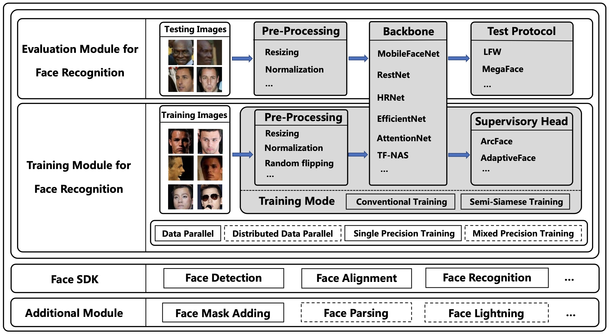

# FaceX-Zoo
FaceX-Zoo is a PyTorch toolbox for face recognition. It provides a training module with various supervisory heads and backbones towards state-of-the-art face recognition, as well as a standardized evaluation module which enables to evaluate the models in most of the popular benchmarks just by editing a simple configuration. Also, a simple yet fully functional face SDK is provided for the validation and primary application of the trained models. Rather than including as many as possible of the prior techniques, we enable FaceX-Zoo to easilyupgrade and extend along with the development of face related domains. Please refer to the [technical report](https://arxiv.org/pdf/2101.04407.pdf) for more detailed information about this project.
  
About the name:
* "Face" - this repo is mainly for face recognition.
* "X" - we also aim to provide something beyond face recognition, e.g. face parsing, face lightning.
* "Zoo" - there include a lot of algorithms and models in this repo.


# What's New
- [Oct. 2021] [Swin Transformer](https://arxiv.org/pdf/2103.14030.pdf) is supported now! We obtain a quite promising result of 98.17 in MegaFace rank1 protocol with Swin-S. For more results, pretrained models and logs please refer to [3.1 Experiments of SOTA backbones](training_mode/README.md). For training face recognition model with Swin Transformer, please refer to [swin_training](training_mode/swin_training). Note that the input size is 224\*224 but not 112\*112 and we use AdamW+CosineLRScheduler to optimize it instead of SGD+MultiStepLR.
- [Sep. 2021] We provide a [Dockfile](docker/Dockerfile) to buid the docker image of this project.
- [Aug. 2021] [RepVGG](https://arxiv.org/pdf/2101.03697.pdf) has been added to the backbones for face recognition, the performance of RepVGG_A0, B0, B1 can be found in [3.1 Experiments of SOTA backbones](training_mode).
- [Jul. 2021] A method for facial expression recognition named [DMUE](https://openaccess.thecvf.com/content/CVPR2021/papers/She_Dive_Into_Ambiguity_Latent_Distribution_Mining_and_Pairwise_Uncertainty_Estimation_CVPR_2021_paper.pdf) has been accepted by CVPR2021, and all codes have been released [here](addition_module/DMUE).
- [Jun. 2021] We evaluate some knowledge distillation methods on face recognition task, results and codes can be found in [face_lightning](addition_module/face_lightning/KDF) module.
- [May. 2021] Tools to convert a trained model to onnx format and the provided sdk format can be found in [model_convertor](addition_module/model_convertor).
- [Apr. 2021] IJB-C 1:1 protocol has been added to the [evaluation module](test_protocol/test_ijbc.sh).
- [Mar. 2021] [ResNeSt](https://hangzhang.org/files/resnest.pdf) and [ReXNet](https://arxiv.org/pdf/2007.00992.pdf) have been added to the backbones, [MagFace](https://arxiv.org/pdf/2103.06627.pdf) has been added to the heads. 
- [Feb. 2021] Distributed training and mixed precision training by [apex](https://github.com/NVIDIA/apex) is supported. Please check [distributed_training](training_mode/distributed_training) and [train_amp.py](training_mode/conventional_training/train_amp.py)
- [Jan. 2021] We commit the initial version of FaceX-Zoo.

# Requirements
* python >= 3.7.1
* pytorch >= 1.1.0
* torchvision >= 0.3.0 

# Model Training  
See [README.md](training_mode/README.md) in [training_mode](training_mode), currently support conventional training and [semi-siamese training](https://arxiv.org/abs/2007.08398).
# Model Evaluation  
See [README.md](test_protocol/README.md) in [test_protocol](test_protocol), currently support [LFW](https://people.cs.umass.edu/~elm/papers/lfw.pdf), [CPLFW](http://www.whdeng.cn/CPLFW/Cross-Pose-LFW.pdf), [CALFW](https://arxiv.org/abs/1708.08197), [RFW](https://arxiv.org/abs/1812.00194), [AgeDB30](https://core.ac.uk/download/pdf/83949017.pdf), [IJB-C](http://biometrics.cse.msu.edu/Publications/Face/Mazeetal_IARPAJanusBenchmarkCFaceDatasetAndProtocol_ICB2018.pdf), [MegaFace](https://arxiv.org/abs/1512.00596) and MegaFace-mask.
# Face SDK
See [README.md](face_sdk/README.md) in [face_sdk](face_sdk), currently support face detection, face alignment and face recognition.
# Face Mask Adding
See [README.md](addition_module/face_mask_adding/FMA-3D/README.md) in [FMA-3D](addition_module/face_mask_adding/FMA-3D).

# License
FaceX-Zoo is released under the [Apache License, Version 2.0](LICENSE).

# Acknowledgements
This repo is mainly inspired by [InsightFace](https://github.com/deepinsight/insightface), [InsightFace_Pytorch](https://github.com/TreB1eN/InsightFace_Pytorch), [face.evoLVe](https://github.com/ZhaoJ9014/face.evoLVe.PyTorch/blob/master/README.md). We thank the authors a lot for their valuable efforts.

# Citation
Please consider citing our paper in your publications if the project helps your research. BibTeX reference is as follows.
```BibTeX
@inproceedings{wang2021facex,
  author = {Jun Wang, Yinglu Liu, Yibo Hu, Hailin Shi and Tao Mei},
  title = {FaceX-Zoo: A PyTorh Toolbox for Face Recognition},
  journal = {Proceedings of the 29th ACM international conference on Multimedia},
  year = {2021}
}
```
If you have any questions, please contact with Jun Wang (wangjun492@jd.com), Yinglu Liu (liuyinglu1@jd.com), [Yibo Hu](https://aberhu.github.io/) (huyibo6@jd.com),  [Hailin Shi](https://sites.google.com/view/hailin-shi) (shihailin@jd.com) and [Wu Liu](http://drliuwu.com)(liuwu1@jd.com).
