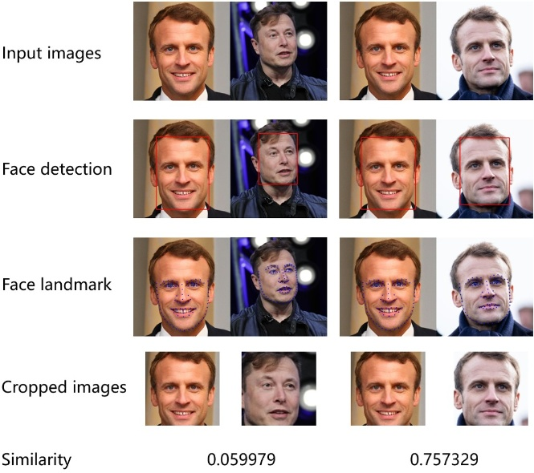
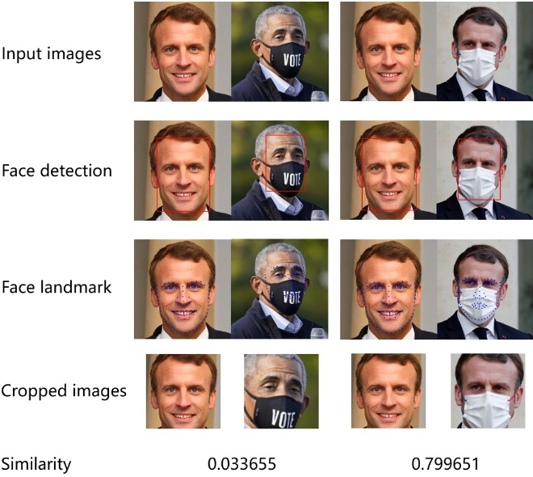

# Face SDK
A simple yet fully functional face SDK written in python, which acts as a demo to help the users learn the usage of each module and develop the further versions.

# Requirements
* python >= 3.7.1  
* pytorch >= 1.1.0  
* torchvision >= 0.3.0 
* yaml  
* itertools  
* skimage  

# Results by the SDK
## Non-masked faces  
  
## Masked faces  
  
## Face Parsing.
  

# Getting Started
## Run the examples
```python
python api_usage/face_detect.py  # Get bounding box of a face 
python api_usage/face_alignment.py  # Get 106 landmark of a face 
python api_usage/face_crop.py  # Get croped face from a image
python api_usage/face_feature.py  # Get features of a face
python api_usage/face_pipline.py # Run face recognition pipeline
python api_usage/face_parsing.py # Run face parsing pipeline, (pytorch >= 1.9.1)
```
The results will be saved at [api_usage/temp](api_usage/temp)
## Update the models  
* Step1: Train or finetune the new model and save it by the function **torch.save**, or convert the trained model by [model_convert.py](utils/model_convert.py).  
* Step2: Create the configuration file **model_meta.json** according to the existing model.  
* Step3: Put the model and the configuration file to the folder **models/face_xxx/face_xxx_version**. Here xxx refers to the corresponding function, e.g., detection, alignment and recognition.
* Step4: Modify the model name according to your own model in [model_conf.yaml](config/model_conf.yaml).  
* Step5: Run the corresponding example.  

## Further development
To add a model trained by other method which is different with our sdk, or to add some modules which are not included in our sdk, you can implement with the following step.  
* Step1: Train a model by your own method.  
* Step2: Create the configuration file **model_meta.json** which should include the common configurations as mentioned in [BaseModelLoader.py](core/model_loader/BaseModelLoader.py) and the specific configurations.
* Step3: Put the model and the configuration file to the folder **models/face_xxx/face_xxx_version**. Here xxx refers to the corresponding function, e.g., detection, alignment and recognition.
* Step4: Create the network definition file in [network_def](models/network_def).
* Step5: Create a model loader in [model_loader](core/model_loader), which should be inherited from the BaseModelLoader. 
* Step6: Create a model handler in [model_handler](core/model_handler), which should be inherited from the BaseModelHandler.
* Step7: Write you own example in [api_usage](api_usage) to show how to call the provided api.
* Step8: Run the new example.

# About the logs
The logs in this sdk are configured by [logging.conf](config/logging.conf).
* In the [core](core) module, we set **logger = logging.getLogger('sdk')**, which will print the detailed logs in logs/sdk.log for debugging.
* In the [api_usage](api_usage) module, we set **logger = logging.getLogger('api')**, which will print the simple logs in the console.

# Reference
This project is mainly inspired by [Pytorch_Retinaface](https://github.com/biubug6/Pytorch_Retinaface), [ChainerCV](https://github.com/chainer/chainercv/), [pfld_106_face_landmarks](https://github.com/Hsintao/pfld_106_face_landmarks), [FaRL](https://github.com/FacePerceiver/FaRL), [InsightFace](https://github.com/deepinsight/insightface), [InsightFace_Pytorch](https://github.com/TreB1eN/InsightFace_Pytorch/blob/master/model.py)

